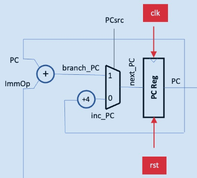

# Alexander Lewis' Personal Statement

## Worked On
* [pc_reg.sv](https://github.com/maxryan4/RISC-V-T7/blob/main/rtl/single-cycle/pc_reg.sv)
* [adder.sv](https://github.com/maxryan4/RISC-V-T7/blob/main/rtl/single-cycle/adder.sv)
* [pc_top.sv](https://github.com/maxryan4/RISC-V-T7/blob/main/rtl/single-cycle/pc_top.sv)
* [F1.s](https://github.com/maxryan4/RISC-V-T7/blob/main/tb/asm/singlecycle/F1.S)
* [vbuddytesting.cpp](https://github.com/maxryan4/RISC-V-T7/blob/F1/tb/tests/vbuddytesting.cpp)
* [static_branch_predictor.sv](https://github.com/maxryan4/RISC-V-T7/blob/main/rtl/pipelined-plus-cache/static_branch_predictor.sv)
* [onebit_dynamic_branch_predictor.sv](https://github.com/maxryan4/RISC-V-T7/blob/main/rtl/pipelined-plus-cache/onebit_dynamic_branch_predictor.sv)
* [twobit_dynamic_branch_predictor.sv](https://github.com/maxryan4/RISC-V-T7/blob/main/rtl/pipelined-plus-cache/twobit_dynamic_branch_predictor.sv)


## Creating the [Program Counter](https://github.com/maxryan4/RISC-V-T7/blob/main/rtl/single-cycle/pc_top.sv)

Relevant commits:
* [Program Counter](https://github.com/maxryan4/RISC-V-T7/commit/4510ebb31ba23ddbe547dc829a456922f848d8f9#diff-a84ae2422af29ec54b49ab60bde228049231ad78d4fdcfffb583808697a55ecdR9)

I made the program counter components for lab 4 which just consisted of a 32 bit register, a multiplexer and two adders. This was the schematic that I followed for the block:



I then instantiated the adders, the MUX and the register in a top file for the program counter block in a file called [pc_top.sv](https://github.com/maxryan4/RISC-V-T7/blob/main/rtl/single-cycle/pc_top.sv).

For most instructions, the program counter increments by 4 bits. This is because RISC-V uses byte-addressable memory and hence each 32-bit word occupies 4 bytes where each byte has a unique address. Therefore, the program counter is usually incremented by 4 each cycle.

However, for branching or jump instructions, the PC changes to a computed target address. In lab 4, the only example of this was the BNE (branch if not equal) instruction but in the full specification of RISC-V 32I, there are the BEQ, BNE, BLT, BGE, BLTU and BGEU branching instructions and the JAL and JALR unconditional jump instructions.

The PCsrc signal in the block is the SELECT signal for the multiplexer which determines whether the PC should increment by 4 or change to a computed target address. The computed target address for a branch or jump instruction is just the current value of the PC added to the immediate value specified in the instruction.

The program counter logic remained almost the same for the pipelined version except a few signals were renamed. Additional logic was also implemented so that branch prediction could be added.

## Writing the [F1 Assembly Code]() and [Testbench]()

Relevant commits:
* [Add F1 test](https://github.com/maxryan4/RISC-V-T7/commit/ff76ae8fc893668e981b1b32b656944c87571cce#diff-25fb594f710cfe75ba264b9f7918b75b62dc4b911ea8c01fb9760e1d64e29dbaR6)
* [F1 testbench](https://github.com/maxryan4/RISC-V-T7/commit/3b946545ef45967807194db8e88d060dc97660a1)

I also helped write the initial implementation for the F1 starting light algorithm in assembly language to run on the CPU. This was co-authored by Max Ryan.

Our initial implementation just used three registers: a0, a1 and s1 and the code looked like this:
```assembly
main:
    add a0, zero, zero
    add a1, zero, zero
    add s1, zero, 7

loop_start:
    bge a1, s1, hang
    addi a1, a1, 1
    slli a0, a0, 1
    addi a0, a0, 1

hang:
    j hang
```
At the end of each iteration of the loop, this would correctly set a0 to `32'b1`, `32'b11`, `32'b111` etc. until `32'b1111111` when all seven lights would be on and the condition for BGE would be satisfied and the program would hang indefinitely.

However, the intermediate instruction `slli a0, a0, 1` would cause a0 to temporarily have the values `32'b10`, `32'b110` etc. which would cause the first light in the sequence to turn off for a very short period of time before the following `addi a0, a0, 1` instruction was executed. We therefore used an additional register `a2` to resolve this:

```assembly
main:
    add a0, zero, zero
    add a1, zero, zero
    add s1, zero, 7

loop_start:
    bge a1, s1, hang
    addi a1, a1, 1
    slli a2, a0, 1
    addi a0, a2, 1

hang:
    j hang
```

This F1 assembly program was later modified by Max again to use the JAL instruction as required by the project brief, but the add and shift instructions in the latest version using JAL are all identical as in the above.

I also wrote a simple [testbench](https://github.com/maxryan4/RISC-V-T7/blob/F1/tb/tests/vbuddytesting.cpp) for the F1 program including Vbuddy functionality. The relevant commit is at the top of this section.


## Writing the [Static Branch Predictor](https://github.com/maxryan4/RISC-V-T7/blob/main/rtl/pipelined-plus-cache/static_branch_predictor.sv)

Relevant commits:
* [Static branch predictor fix]()

Without branch prediction, all branches are assumed to be not taken. This means with increased pipeline stages, there is a higher penalty due to flushing if a branch actually is taken. 

The static branch predictor assumes that forward branches are not taken, and backward branches are taken. This is because in many programs, there are often loops (e.g. for or while loops) in which many backward branches will be taken, hence our prediction.

The static branch predictor is implemented in the fetch stage and has almost no other interaction with the CPU apart from the instruction memory and program counter.

```verilog
always_comb begin
        case (RD[6:0])
            // Branch Instructions
            7'b1100011: branch_target = PC_f + {{20{RD[31]}},RD[7],RD[30:25],RD[11:8],1'b0};
            
            // JAL
            7'b1101111: branch_target = PC_f + {{12{RD[31]}},RD[19:12],RD[20],RD[30:21],1'b0};

            default: branch_target = PC_f + 32'd4;
        endcase
        
        if (RD[6:0] == 7'b1100011) begin            // if branch instruction
            predict_taken = (branch_target < PC_f) ? 1'b1 : 1'b0;   // only take jump if backwards branch
        end else if (RD[6:0] == 7'b1101111) begin   // JAL instruction
            predict_taken = 1'b1;       // always take jump (unconditional)
        end else begin
            predict_taken = 1'b0;       // never take jump if JALR (or any other instruction)
        end
    end
```
The target address for the branch and jump instructions is initially computed from the current value of the PC and the immediate constant fields in the instruction. The `predict_taken` signal is that set to 1 if the target address is less than the current program counter for branch instructions (i.e. backwards branch) and set to 0 if the target address is more than the current program counter (i.e. forward branch).

JAL instructions are always taken as these are unconditional jumps.

An additional multiplexer was also added to the `pc_top.sv` file to determine whether PC + 4 or the predicted branch target address would be used for the next instruction. Of course, if the prediction turned out to be wrong, the CPU would have to be flushed.

## Writing the [One-Bit Dynamic Branch Predictor]()

Relevant commits:
* []()


## Writing the [Two-Bit Dynamic Branch Predictor]()

Relevant commits:
* []()


## What I learned


## If I had more time