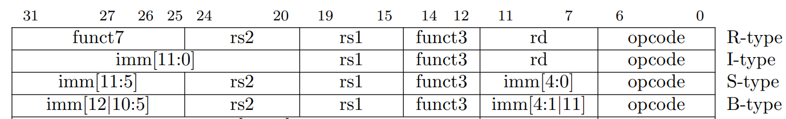
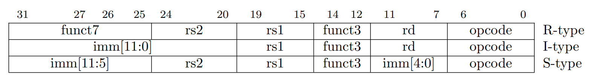
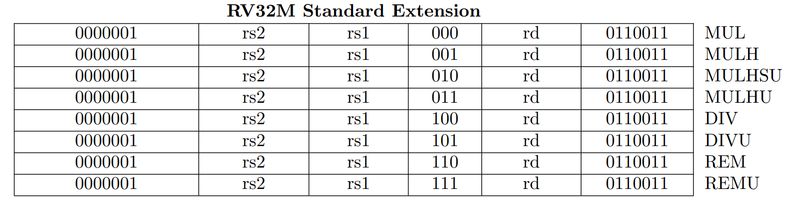

# Max Ryan's Personal Statement

<!--# Table of Contents
FINISH!!!!!!
1. [Table of Contents](#table-of-contents)
2. [Worked On](#worked-on)
3. [Creating the ALU.sv file](#creating-the-ALU.sv-file)
4. [Fourth Example](#fourth-examplehttpwwwfourthexamplecom)-->

## Worked on

* [ALU.sv](https://github.com/maxryan4/RISC-V-T7/blob/main/rtl/ALU.sv)
* [register_file.sv](https://github.com/maxryan4/RISC-V-T7/blob/main/rtl/register_file.sv)
* [F1.S](https://github.com/maxryan4/RISC-V-T7/blob/main/tb/asm/other/F1.S)
* [top.sv (pipelined version)](https://github.com/maxryan4/RISC-V-T7/blob/main/rtl/top.sv)
* [fetch_reg_file.sv](https://github.com/maxryan4/RISC-V-T7/blob/main/rtl/fetch_reg_file.sv)
* [decode_reg_file.sv](https://github.com/maxryan4/RISC-V-T7/blob/main/rtl/decode_reg_file.sv)
* [execute_reg_file.sv](https://github.com/maxryan4/RISC-V-T7/blob/main/rtl/execute_reg_file.sv)
* [mem_reg_file.sv](https://github.com/maxryan4/RISC-V-T7/blob/main/rtl/mem_reg_file.sv)
* [ALU_top.sv](https://github.com/maxryan4/RISC-V-T7/blob/main/rtl/ALU_top.sv)
* [mul.sv](https://github.com/maxryan4/RISC-V-T7/blob/main/rtl/mul.sv)
* [div_sc.sv](https://github.com/maxryan4/RISC-V-T7/blob/main/rtl/div_sc.sv)
* [div_mc.sv](https://github.com/maxryan4/RISC-V-T7/blob/main/rtl/div_mc.sv)

## Creating the [ALU.sv](https://github.com/maxryan4/RISC-V-T7/blob/main/rtl/ALU.sv) file

Relevant commits:

* [Added ALU.sv](https://github.com/maxryan4/RISC-V-T7/commit/8fe9384bd8290fa43b6ef007f8e6c5db33f8beee)

The ALU needed to be able to handle R, I and B-type instructions.
The R-type instructions are arithmetic instructions between two registers.
The I-type instructions are arithmetic instructions between the value in a register and an immediate.
The B-type instructions determine whether or not to branch based off of the relation between 2 registers such as if they are equal. 
If the condition that is being tested holds it branches to PC + offset.



In order to do this I used bit 6 of func7 and all 3 bits of func3 to form the 4-bit ALUctrl signal. 
This is then used to determine which instructions is used and so what the ALU output should be.
The only exception to this is for addi instructions. 
Due to the fact that the the imm part of I-type instructions overlaps with func7 so for addi there was a chance that it would be interpreted as a sub instruction as so in the control unit if is an addi instruction it sets the func7[5] part of ALUctrl to 0 so that the ALU interprets it correctly.

For branch instructions the type of branch instruction is determined by the func3 part of the instruction.
So depending on the value of func3 a different comparison is made between the two input operands and if the comparison is true EQ is set high which tells the control unit that it should branch.


## Creating the [register_file.sv](https://github.com/maxryan4/RISC-V-T7/blob/main/rtl/register_file.sv) file

Relevant commits:

* [Added register file](https://github.com/maxryan4/RISC-V-T7/commit/dca6e6a73b0347808aadeab3682befb48d18ad23)

The register file has an output a0 which is register a0 so that it can be read by the testbench. 
For the pipelined version of the register file it is written to on the falling edge of the clock.


## Creating [F1.S](https://github.com/maxryan4/RISC-V-T7/blob/main/tb/asm/other/F1.S)

Relevant commits:

* [F1.S with JAL](https://github.com/maxryan4/RISC-V-T7/commit/e850082e010014a2ff4864bc402a8b648ee823e4)

F1.S has 3 main sections.

Firstly the a0 and a1 are initialised to 0 and s1 is initialised to 8.

```assembly
main:
    li a0, 0
    li a1, 0
    li s1, 8
```

Then a1 is checked to see if it is larger than 8. If it is we stop. If it isn't we increment again.

```assembly
loop_start:
    bge a1, s1, stop
    jal t1, increment
    j loop_start
```

When incrementing a0 a2 is set as a0 shifted left by 1.
Then a0 is set as a2 + 1.
This way it means that a0 appears to just have the next light light up whereas if you just shifted a0 left by 1 and then added 1 for one clock cycle the bottom light would be off.

```assembly
increment:
    addi a1, a1, 1
    slli a2, a0, 1
    addi a0, a2, 1
    jalr x0, 0(t1)
```

## Adding pipelining

* [top.sv (pipelined version)](https://github.com/maxryan4/RISC-V-T7/blob/main/rtl/top.sv)
* [fetch_reg_file.sv](https://github.com/maxryan4/RISC-V-T7/blob/main/rtl/fetch_reg_file.sv)
* [decode_reg_file.sv](https://github.com/maxryan4/RISC-V-T7/blob/main/rtl/decode_reg_file.sv)
* [execute_reg_file.sv](https://github.com/maxryan4/RISC-V-T7/blob/main/rtl/execute_reg_file.sv)
* [mem_reg_file.sv](https://github.com/maxryan4/RISC-V-T7/blob/main/rtl/mem_reg_file.sv)

Relevant commits:

* [Added the register files and modified top file and modified various other files to correctly implement pipelining](https://github.com/maxryan4/RISC-V-T7/commit/22f02ac5bdd790da685f5c0b23684fa1ec3e70a5)

Created a register file between each stage to pass data from one stage to the next. I made 4 register files to handle transferring signals from fetch to decode, decode to execute, execute to data memory, data memory to write back stage.

Added extra input and output signals to PC_top.sv and control_unit.sv in order to properly implement the pipeline.


### Top File

Connected the different stages together via the pipelining registers.

### Pipeline Registers

The pipeline registers have a reset which is negative edge triggered which can be used to flush the pipelining registers.
They have an enable pin which can be used to stall the pipeline if it is set low.
They also have a valid signal which means that the data won't propogate if it isn't valid although the valid signal will still propagate through the pipeline.


## RV32M Instructions

* [ALU_top.sv](https://github.com/maxryan4/RISC-V-T7/blob/main/rtl/ALU_top.sv)
* [mul.sv](https://github.com/maxryan4/RISC-V-T7/blob/main/rtl/mul.sv)
* [div_sc.sv](https://github.com/maxryan4/RISC-V-T7/blob/main/rtl/div_sc.sv)
* [div_mc.sv](https://github.com/maxryan4/RISC-V-T7/blob/main/rtl/div_mc.sv)

Relevant commits:

* [Added modules](https://github.com/maxryan4/RISC-V-T7/commit/61314412002fe7c88f66d08441eb04fa869064fd)
* [Implemented modules in top file](https://github.com/maxryan4/RISC-V-T7/commit/81c52c323b3c867a64cdecd1d04e0d2c173b261f)





### ALU_top

Created to unify the ALU instructions from the RV32I instruction set with the RV32M instructions into one overarching modules with a few submodules.
func3[2] is used to tell if the instruction is a multiply or divide instruction. It is 1 for a divide instruction and 0 for a multiply instruction.

The mul_sel signal is func7[0] which is high if it is a multiplication or division instruction.

### Multiplication

There are 2 types of multiplication instruction which determine whether you want the upper or lower 32 bits out of the full 64 bit result.
The MUL instruction returns the lower 16 bits.
The MULH, MULHSU, MULHU return the largest 16 bits based off of either a signed \* signed, signed \* unsigned or unsigned \* unsigned interpretation of the operands respectively.
These instructions are distinguished by func3[1:0].

### Division

There are 2 types of division instructions these being DIV and REM and for each of these instructions there is a signed and unsigned version of the instruction.
DIV instructions return the result of the division rounded down to the nearest integer.
REM instructions return the remainder of the division.
These instructions are distinguished by func3[1:0].

#### Single Cycle Division

Implemented division in a single cycle.
However using the SystemVerilog / and % operators causes large blocks of hardware to be synthesised which will drastically lower the maximum clock speed of the CPU.

#### Multicycle Division

Uses the restoring division algorithm for division.
It takes 32 cycles to do a single division operation.
This means that the clock speed of the CPU won't be affected too much by the division hardware which if you wanted to do in one cycle would be very a very large module physically.
In the divide by 0 case the quotient is the maximum value that can be stored based off of whether it was a signed or unsigned division.
The remainder will be the value of the quotient as there is no actual meaningful result for the value of the quotient and you can't have a remainder that is larger than the quotient so I set the remainder to the value of the quotient.

Since division takes 32 cycles to complete with this implementation the pipeline has to be stalled until the result is ready.
This is necessary because if the pipeline wasn't stalled you would have to insert NOPs or the same instruction 32 times

In order to do the division I used an iterative approach.

The most significant bit of dividend_reg is shifted into the LSB of remainder_reg.
This essentially adds the next digit of the dividend to the remainder a bit like bringing down the digit in long division.
Then the dividend_reg is shifted left by 1.
This effectively removes the already processed MSB and shifts the next bit up for processing.

```Verilog
temp_reg = {remainder_reg[DATA_WIDTH-2:0], dividend_reg[DATA_WIDTH-1]};
dividend_reg <= {dividend_reg[DATA_WIDTH-2:0], 1'b0}
```

Then if temp_reg is larger than divisor_reg remainder_reg is set to remainder_reg - divisor_reg.
This is just like in normal long division.
Then the quotient is shifted left by 1 with its LSB being set to 1.
Otherwise the quotient_reg is shifted left.
This is done to build the quotient correctly based off of whether the divisor fitted into remainder_reg.

```Verilog
if (temp_reg >= divisor_reg) begin
    remainder_reg <= temp_reg - divisor_reg;
    quotient_reg <= {quotient_reg[DATA_WIDTH-2:0], 1'b1};
end 
else begin
    quotient_reg <= {quotient_reg[DATA_WIDTH-2:0], 1'b0};
    remainder_reg <= temp_reg;
end
```

These 2 blocks of code are repeated 32 times but unfortunately with the current implementation it does not give the correct result.

## What I learned

I learnt a lot about how to write SystemVerilog as well as gained a good understanding of the RISC-V instruction set and how you implement an instruction set to design a CPU.
From doing the pipelined version of the top file I gained a very thorough understanding of how the whole CPU works.
This also enabled me to understand how pipelining is actually implemented.
I learnt about various methods of implementing division in a CPU.

## If I had more time

I would look at doing out of order execution while the division is happening.
I would also look at doing out of order execution in general and adding floating point arithmetic.
